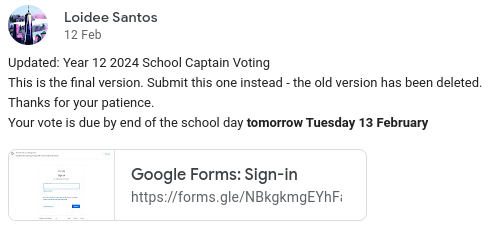
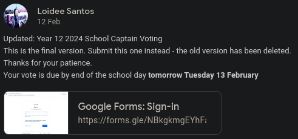

Yet again, the elections for our school leaders have been an absolute sheep-show. 

On the 2nd of February (Friday Week 1), an announcement was made on the Senior Campus noticeboard: if you're interested in becoming a School Captain, please fill out the form. Having the expression of interest form released on the first week of school is incredibly early, but alright. Could be a once off thing.

A week later, on the 12th of February (Monday Week 3), a second announcement was made stating that voting was open, and due the next day. This was the first mistake. Having the results for an election due the next day was an incredibly short window of time, and Google Classroom notifications are notoriously slow. There was a chance that if you weren't fast enough, you could miss the opportunity to have your say. What if you're sick? What if you're busy? At least the prime minister election cycle has a whole weekend at minimum. 

Later that day, there was another announcement:

{: .light }
{: .dark }

They just deleted the form out of thin air? Why? What happened to all the responses? Now everyone who responded to the original form had to do it again! What were they thinking? Can't they just edit the existing form instead of deleting and recreating it? It's ridiculous. 

On top of that, on the updated form[^1], it wasn't possible to vote for two people! It wasn't configured as a tick box form, which can let you pick more than one option, there wasn't a second "who do you want for the other school captain?" box, and there certainly wasn't an option to 
# Footnotes

[^1]: I didn't have access to the original form, for those who did please let me know if this was consistent across both of them!